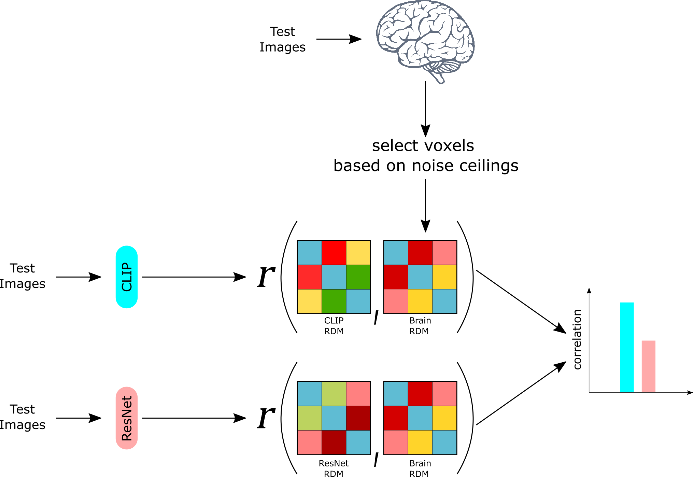

# mutlimodal-concepts

Code to reproduce the results presented in the SVRHM Workshop (NeurIPS 2021) paper ['Multimodal neural networks better explain multivoxel patterns in the hippocampus'](https://openreview.net/forum?id=6dymbuga7nL).

## Introduction

<!-- 

 -->

## Reproducing the results
Please download the fMRI data from [KamitaniLab](https://github.com/KamitaniLab/GenericObjectDecoding)

### Setup 

The requirements/dependencies are mentioned in `requirements.txt`.

`kamitani_utils.py` demonstrates how to use the beta files (obtained after GLM) and the latent representations of the images (obtained from models). You can adapt this file as per your requirements.

`main_analysis.py` can be used to replicate/reproduce all the results shown in the paper. The file creates 3 plots -- a normalized version, a non-normalized version, and a modality-specific version. It takes configuration from the `config.yaml` file. Please update that file as desired before running `main_analysis.py`.

